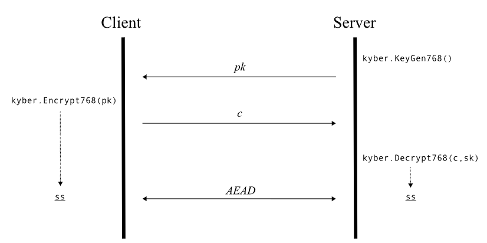

# Crystal_Kyber_Client

Kyber is a post-quantum cryptographic algorithm designed to secure communications in a world where quantum computers could break traditional encryption methods. Developed as part of the NIST Post-Quantum Cryptography Standardization Project, Kyber ensures that data remains secure against the computational power of future quantum computers.

This repository contains the client-side implementation of the Kyber post-quantum cryptographic algorithm. The client side is responsible for initiating secure communications, generating public/private key pairs, and encrypting messages to be sent to the server.

# Purpose:
To securely generate and manage public/private key pairs.



The provided picture illustrates the interaction between the client-side and server-side implementations of Kyber using public key encryption and the KEM (Key Encapsulation Mechanism). The client initiates the communication by generating key pairs and encrypting data(C) cipher containing (encapsulated key) using public key of the server, after encryption which is then securely transmitted to the server. The server receives the encrypted (C) cipher data containing (encapsulated symmetric Key), the server side decrypts it using private key of their own, and processes the request, ensuring a secure end-to-end communication channel to get the same key on both ends. This setup is designed to safeguard against potential threats posed by quantum computing advancements, ensuring long-term data security.

## Installation
Instructions for setting up the server-side application.

## Usage
Using Node.js (v16.17.0):
```
npm install crystals-kyber
```
Import the module at the top of your js file.

```
const kyber = require('crystals-kyber');
```
To use in your code (768 can be replaced with 512 or 1024).
```
// To generate a public and private key pair (pk, sk)
let pk_sk = kyber.KeyGen768();
let pk = pk_sk[0];
let sk = pk_sk[1];
```
## Further details about Kyber
Guidelines for contributing to the project.
